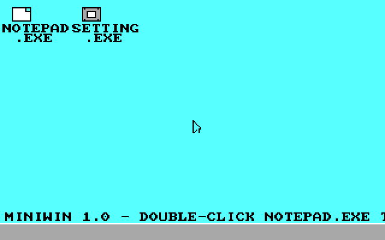

# MiniWin

A dependency-free 32-bit x86 desktop OS that boots from a single MBR
disk image straight into a Windows-95-flavored GUI: real mode → protected
mode by hand, a from-scratch VGA/mouse/keyboard/ATA stack, and a windowing
system with no libc, no bootloader framework, and no borrowed kernel code.



## What's actually in here

- **Boot**: a 512-byte MBR bootloader (`boot/boot.asm`) that switches to
  protected mode and loads the kernel via BIOS INT13h extended (LBA) reads,
  512KB budget, all real addressing under 1MB so it works with no A20
  shenanigans during load.
- **Kernel**: freestanding C (`kernel/kernel.c` + headers), no libc. VGA
  mode 13h (320x200, 256-color palette -- a 6x6x6 color cube + grayscale
  ramp on top of the classic 16), a PS/2 mouse + keyboard driver, PC
  speaker beep, a tiny 4-slot ATA-backed filesystem, PCI enumeration, and
  a COM1 serial debug log.
- **Desktop**: draggable/resizable/minimizable/maximizable windows with
  real overlapping z-order (click a window, it comes to front), a
  Windows-95-style Start Menu with a cascading Shut Down/Restart flyout
  (both genuinely halt/reboot the machine), and a taskbar that lists
  minimized windows in the order you minimized them.
- **Apps**: NOTEPAD.EXE (supports opening several documents at once, each
  in its own window, saving to real persistent disk storage) and
  SETTING.EXE (System language switch between English/한국어 -- actually
  retranslates the whole UI live -- and a multi-select IME picker that
  controls what Right Alt cycles through while typing).
- **Hangul**: a real IME (2-beolsik-style jamo composition) backed by a
  full modern-Hangul-syllable bitmap font (11,172 glyphs, generated from
  the bundled Dalmoori TTF -- see `tools/gen_hangul_font.py`).

## Building

Needs `nasm`, a 32-bit-capable `gcc` (`gcc-multilib` on Debian/Ubuntu if
you're on a 64-bit host), and `ld`.

```bash
./build.sh
```

Produces `build/os-image.img`, a raw disk image.

## Running

```bash
qemu-system-i386 -drive file=build/os-image.img,format=raw
```

To actually **hear** the PC-speaker beep (Notepad's unsaved-changes
warning), QEMU needs an audio backend explicitly attached -- it isn't on
by default:

```bash
qemu-system-i386 -drive file=build/os-image.img,format=raw \
  -audiodev pa,id=snd0 -machine pcspk-audiodev=snd0
```

(swap `pa` for `dsound`, `coreaudio`, `sdl`, or whatever backend your
platform's QEMU build supports -- run `qemu-system-i386 -audio-help` to
list them.)

To attach a NIC (for PCI/driver work in progress -- see Roadmap):

```bash
qemu-system-i386 -drive file=build/os-image.img,format=raw \
  -netdev user,id=n0 -device rtl8139,netdev=n0 \
  -serial file:serial.log
```

## Controls

- Mouse: click, drag title bars, click the `_`/`□`/`X` buttons.
- **Right Alt**: cycle input method (only meaningful languages enabled in
  SETTING.EXE > SYSTEM > IME get cycled through).
- **Ctrl+S / Ctrl+N / Ctrl+W** inside Notepad: Save / New / Close.

## Project layout

```
boot/boot.asm       MBR bootloader (real mode -> protected mode, disk load)
kernel/kentry.asm   32-bit entry stub (BSS clear, calls kmain)
kernel/kernel.c     the OS itself: GUI, window manager, Notepad, Settings
kernel/*.h          one subsystem per header (vga, keyboard, mouse, ata,
                    fs, font, font_ko, hangul_ime, speaker, serial, pci, io)
tools/gen_hangul_font.py   generates font_ko_data.h from the Dalmoori TTF
third_party/        bundled font source + its own license/notice
build.sh            nasm + gcc + ld pipeline -> build/os-image.img
screenshots/        yep
```

## Roadmap / known limitations

This is being actively built out. Current honest state of the bigger
asks:

- **Persistence**: real, already working -- saved files live on the ATA
  disk image itself (`kernel/fs.h`), and survive across QEMU runs as long
  as `os-image.img` isn't rebuilt from scratch.
- **Networking**: a real, verified RTL8139 driver (`kernel/rtl8139.h`) --
  PCI bus mastering, ring-buffer RX, 4-slot round-robin TX, all polled
  (no interrupts). Verified end-to-end against QEMU's SLIRP gateway: the
  driver sends a real hand-built ARP request and genuinely receives the
  gateway's ARP reply back, logged over the serial port
  (`kernel/serial.h`) for anyone who wants to reproduce it:
  ```
  [RTL8139] initialized, MAC=52:54:00:12:34:56
  [ARP] sending request
  [RX] 0040 bytes, ethertype=0806 ARP REPLY from 52:55:0A:00:02:02
  ```
  An e1000 driver is next (MMIO-based, meaningfully more involved than
  RTL8139's pure port-I/O interface -- in progress). Above the NIC driver
  layer there's still no ARP/IP/TCP stack or browser (MiniWeb) yet --
  `kernel/net_diag.h` is explicitly a throwaway bring-up harness for
  proving the driver works, not a network stack.
- **File Manager**: not built yet.
- Full HTML4/5/XHTML rendering and "SSE3 support" are not realistic
  targets for a 320x200, 16-/256-color, no-libc kernel like this one --
  if/when MiniWeb happens, it'll be an honestly-scoped local hypertext
  viewer, not a general-purpose browser engine.
- No dynamic program loading/execution exists (everything is compiled
  into the one kernel binary) -- a real "install and run third-party
  .MPI programs" system would need a loader and some kind of process
  model that doesn't exist yet.
- No real internet-backed accounts or third-party (Google/Microsoft)
  sign-in are planned, since this kernel has no TCP/IP stack, no TLS, and
  no registered OAuth credentials to talk to those services with -- any
  "sign in" UI here would need to be honestly local-only.

## License

MiniWin's own code is MIT-licensed -- see `LICENSE`. The bundled Dalmoori
font (`third_party/dalmoori-font/`) is Apache-2.0 licensed by its own
authors; see the `LICENSE`/`NOTICE.md` in that directory.
