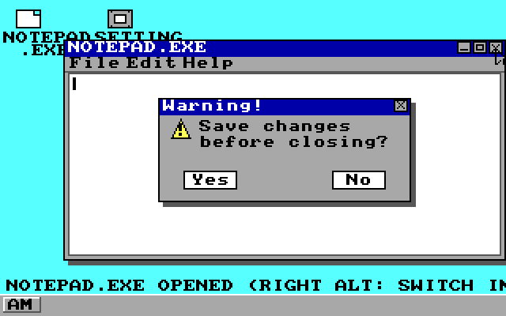
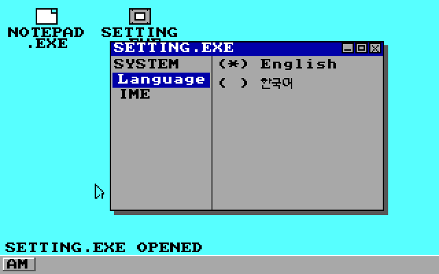
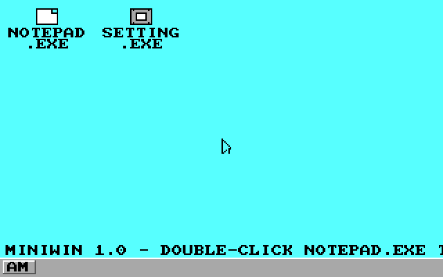

# MiniWin 1.0-pre-1

> A tiny 32-bit GUI operating system experiment that boots directly on x86 BIOS.

MiniWin is a small hobby OS project that implements the entire path from a **BIOS bootloader → 32-bit C kernel → VGA/keyboard/mouse/ATA drivers → a simple desktop GUI**.

The project takes inspiration from the Windows 95-era desktop UI while focusing on low-level x86 programming and understanding how an operating system interacts directly with hardware.

The current build uses **VGA Mode 13h (320×200, 256 colors)** and includes a Notepad application, Settings application, mouse input, Korean IME, and a simple disk storage system.

---

## ✨ Features

### Bootloader / Kernel

* 16-bit Stage 1 bootloader running from BIOS
* BIOS `INT 13h Extensions` for LBA kernel loading
* A20 line enabling
* GDT setup
* 32-bit protected mode transition
* Freestanding C kernel
* i386 ELF linking and raw binary conversion
* Loads up to **1024 sectors / 512 KiB** of kernel data
* Assembly kernel entry stub

### Graphics / Desktop

* VGA Mode 13h

  * Resolution: **320×200**
  * Colors: **256**
* Direct VGA DAC palette configuration
* 6×6×6 RGB color cube + grayscale palette
* Double buffering using a back buffer
* Desktop environment with mouse cursor
* Windows 95-inspired UI
* Taskbar
* Start Menu
* Window dragging
* Minimize / maximize / restore / close
* Per-window taskbar buttons
* Multiple applications running simultaneously

### NOTEPAD.EXE

* Text input
* Backspace / Enter / Space / ASCII character input
* `File` menu

  * Save As
  * Save
  * New
* `Ctrl+S` — Save
* `Ctrl+N` — New document
* `Ctrl+W` — Close
* Unsaved-changes confirmation dialog
* Warning dialog with PC speaker beep
* Saved documents displayed as desktop file icons
* Double-click desktop files to reopen them

> **Note:** `Save As` currently exists as a UI entry, but the actual filename-selection functionality has not been implemented yet.

### Korean IME

* Standard **2-beolsik Korean keyboard layout**
* Initial / medial / final consonant-vowel composition
* Compound vowel composition

  * ㅗ + ㅏ → ㅘ
  * ㅜ + ㅓ → ㅝ
  * ㅡ + ㅣ → ㅢ
  * and others
* Compound final consonants
* Final-consonant hand-back when starting the next syllable
* Backspace support during composition
* UTF-8 Hangul syllable generation
* IME switching with `Right Alt`
* English / Korean IME enable/disable settings

### SETTING.EXE

Provides a basic `SYSTEM` settings window.

* OS UI language

  * English
  * 한국어
* IME settings

  * English
  * Korean
* At least one IME must remain enabled
* Window dragging
* Minimize / maximize / restore

### Input Devices

#### PS/2 Keyboard

* Shift
* Ctrl
* Arrow keys
* Right Alt
* Basic ASCII input

#### PS/2 Mouse

* Mouse movement
* Left / right buttons
* Click edge detection
* Window dragging
* Protection against invalid / overflowed mouse packets

### Storage

MiniWin currently uses a simple fixed-slot storage system.

> This is **not a conventional filesystem**. It uses four fixed storage slots.

| Slot | Filename            | Storage Area  |
| ---- | ------------------- | ------------- |
| 0    | `NEW_TXT_DOC.TXT`   | LBA 1100–1108 |
| 1    | `NEW_TXT_DOC_2.TXT` | LBA 1109–1117 |
| 2    | `NEW_TXT_DOC_3.TXT` | LBA 1118–1126 |
| 3    | `NEW_TXT_DOC_4.TXT` | LBA 1127–1135 |

* Maximum **4096 bytes per file**
* ATA PIO read/write
* Write-cache flush
* Data persists when the same disk image is reused
* No filename editing, deletion, directories, or conventional filesystem support yet

### PCI

* Direct PCI configuration-space access
* Bus / Slot / Function enumeration
* Vendor ID / Device ID / Class / Subclass / BAR inspection
* PCI device discovery logs through the serial port
* Basic infrastructure for identifying network controllers

> The PCI implementation is currently focused on **device enumeration and diagnostics**. A general-purpose network stack or NIC driver is not implemented yet.

### PC Speaker

* Simple square-wave generation using PIT Channel 2
* Used for warning sounds in Notepad dialogs

---

## 🖼️ Screenshots

### Desktop


### Unsaved Changes Warning



### SETTING.EXE



### 256-Color / PCI-NIC Development Build



---

## 🧱 Project Structure

```text
miniwin-release/
├── boot/
│   └── boot.asm
│
├── kernel/
│   ├── kernel.c
│   ├── kentry.asm
│   ├── link.ld
│   ├── io.h
│   ├── vga.h
│   ├── keyboard.h
│   ├── mouse.h
│   ├── ata.h
│   ├── fs.h
│   ├── pci.h
│   ├── serial.h
│   ├── speaker.h
│   ├── font.h
│   ├── font_ko.h
│   ├── font_ko_data.h
│   └── hangul_ime.h
│
├── tools/
│   └── gen_hangul_font.py
│
├── third_party/
│   └── dalmoori-font/
│       ├── dalmoori.ttf
│       ├── LICENSE
│       └── NOTICE.md
│
├── screenshots/
│   ├── 01-boot-desktop.png
│   ├── 02-warning-dialog.png
│   ├── 03-setting-minmax.png
│   └── 04-boot-256color-nic.png
│
├── build/
│   └── os-image.img
│
└── build.sh
```

---

## 🔧 Build Environment

The project is primarily designed for Linux.

Required tools:

* `bash`
* `nasm`
* `gcc` with 32-bit compilation support
* `ld`
* `objcopy`
* `python3`
* `qemu-system-i386`

On Ubuntu/Debian-based systems:

```bash
sudo apt install nasm gcc binutils python3 qemu-system-x86
```

Depending on your environment, additional 32-bit GCC support packages may be required.

---

## 🚀 Building

From the project root:

```bash
./build.sh
```

The build process consists of five stages:

```text
[1/5] bootloader assemble
[2/5] kernel entry assemble
[3/5] C kernel compile
[4/5] kernel link
[5/5] disk image build
```

The build directory contains:

```text
build/
├── boot.bin
├── kentry.o
├── kernel.o
├── kernel.elf
├── kernel.bin
└── os-image.img
```

The final disk image is:

```text
build/os-image.img
```

---

## ▶️ Running with QEMU

After building:

```bash
qemu-system-i386 -drive format=raw,file=build/os-image.img
```

To also view serial output:

```bash
qemu-system-i386 \
  -drive format=raw,file=build/os-image.img \
  -serial stdio
```

PCI initialization prints discovered device information to the serial console:

```text
[PCI] scanning...
[PCI] bus=...
...
[PCI] scan complete, ... device(s)
```

---

## 🎮 Controls

### Desktop

* Double-click `NOTEPAD.EXE` → Launch Notepad
* Double-click `SETTING.EXE` → Launch System Settings
* Drag a window title bar → Move the window
* Click `-` → Minimize
* Click `[]` → Maximize / restore
* Click `X` → Close
* Click a taskbar button → Restore a minimized window

### Notepad

| Input             | Action                       |
| ----------------- | ---------------------------- |
| Normal characters | Insert text                  |
| Backspace         | Delete                       |
| Enter             | New line                     |
| `Ctrl+S`          | Save                         |
| `Ctrl+N`          | New document                 |
| `Ctrl+W`          | Close                        |
| `Right Alt`       | Switch IME                   |
| `Y` / `N`         | Respond to save confirmation |

When the Korean IME is enabled, Korean text can be entered using a standard 2-beolsik keyboard layout.

---

## 🖥️ Boot Flow

The MiniWin boot process looks like this:

```text
BIOS
 │
 ▼
boot/boot.asm
 │
 ├─ BIOS INT 13h Extended LBA Read
 │
 ├─ Load kernel → 0x10000
 │
 ├─ Enable A20
 │
 ├─ Load GDT
 │
 └─ Enter Protected Mode
       │
       ▼
kernel/kentry.asm
       │
       ▼
kernel.c
       │
       ├─ VGA Mode 13h
       ├─ Palette initialization
       ├─ PCI scan
       ├─ Mouse initialization
       ├─ Desktop initialization
       └─ Main event loop
```

---

## 💾 Disk Image Layout

The bootloader reads the kernel starting at **LBA 1**, for up to **1024 sectors**.

```text
LBA 0
└── Boot sector (512 bytes)

LBA 1–1024
└── Kernel area
    └── Up to 512 KiB

LBA 1025–1099
└── Reserved / growth area

LBA 1100–1135
└── MiniWin fixed-slot storage
    ├── Slot 0
    ├── Slot 1
    ├── Slot 2
    └── Slot 3
```

`build.sh` pads the final disk image to **1200 sectors**.

### ⚠️ Storage Persistence

`build.sh` creates a new `build/os-image.img` each time it runs.

Therefore:

```bash
./build.sh
```

will reset any Notepad data previously stored in the disk image.

In other words:

* Running the **same image** multiple times → saved data persists
* Running `build.sh` again → a new image is created and saved data is reset

---

## 🧠 Implementation Overview

MiniWin intentionally avoids relying on existing OS APIs wherever possible and instead interacts directly with x86 hardware.

### VGA

```text
VGA registers
     │
     ▼
Mode 13h
     │
     ▼
Back buffer
     │
     ▼
vga_present()
     │
     ▼
0xA0000 VGA framebuffer
```

The desktop is rendered into a back buffer and then copied to the VGA framebuffer once per frame to reduce visual flickering.

### Input

```text
PS/2 Keyboard ──┐
                ├── Kernel event loop ── GUI / Notepad
PS/2 Mouse ─────┘
```

Mouse packets are assembled as 3-byte PS/2 packets with protection against overflow and packet synchronization issues.

### Hangul IME

```text
Keyboard input
      │
      ▼
2-beolsik mapping
      │
      ▼
Jamo composition state
      │
      ├── Initial
      ├── Medial
      └── Final
      │
      ▼
Unicode Hangul syllable
      │
      ▼
UTF-8 text buffer
```

---

## 🗺️ Current Status

### Implemented

* [x] BIOS bootloader
* [x] 32-bit protected mode
* [x] C kernel
* [x] VGA Mode 13h
* [x] 256-color palette
* [x] Double buffering
* [x] Desktop
* [x] Mouse cursor / mouse input
* [x] Window management
* [x] Taskbar
* [x] Start Menu
* [x] Notepad
* [x] Save / Load
* [x] Fixed-slot disk storage
* [x] Korean 2-beolsik IME
* [x] English / Korean UI
* [x] Settings application
* [x] PS/2 keyboard
* [x] ATA PIO storage
* [x] PCI enumeration
* [x] Serial debug output
* [x] PC speaker warning sound

### Planned / Not Yet Implemented

* [ ] Real filesystem
* [ ] File deletion
* [ ] File renaming
* [ ] Directories
* [ ] Full `Save As` functionality
* [ ] General network stack / NIC driver
* [ ] Full interrupt architecture
* [ ] Timer / scheduler
* [ ] User mode / process isolation
* [ ] Memory management
* [ ] USB input devices
* [ ] ACPI-based shutdown
* [ ] Multitasking

---

## 📚 Third-Party

MiniWin uses **Dalmoori Font (달무리)** for Korean glyph data.

* Source: `RanolP/dalmoori-font`
* License: **Apache License 2.0**
* Copyright: 2020 RanolP and contributors

The original TTF is included under:

```text
third_party/dalmoori-font/
```

It is used to generate the 8×8 Hangul glyph bitmap data used by the kernel.

See the following files for the complete licensing information:

```text
third_party/dalmoori-font/LICENSE
third_party/dalmoori-font/NOTICE.md
```

---

## ⚠️ Project Status

MiniWin is an **educational / experimental hobby OS project**.

It is not intended to replace a general-purpose desktop operating system. The current implementation has several significant limitations:

* 32-bit x86 focused
* BIOS boot required
* Developed and tested primarily with QEMU
* Fixed memory and disk layout
* Very limited storage system
* Early-stage interrupt, process, and memory-management architecture

The main goal is to understand the low-level process of **booting a computer, initializing hardware, rendering graphics, handling input, and building a GUI directly on top of a small kernel**.

---

## 📄 License

The current MiniWin release does **not** include a separate `LICENSE` file for the MiniWin source code.

If you plan to publish this project on GitHub, it is recommended to choose a license for the MiniWin source and add a corresponding `LICENSE` file.

The license for `third_party/dalmoori-font/` is separate from the MiniWin project license and must be respected independently.

---

## 🙌 Roadmap

MiniWin is intended to grow from a tiny bootable kernel into a more complete operating-system experiment:

```text
Bootloader
    ↓
Protected Mode
    ↓
Kernel
    ↓
Hardware Drivers
    ↓
Graphics
    ↓
Input
    ↓
Storage
    ↓
IME
    ↓
GUI
    ↓
Processes / Networking / More
```

The goal is to start with a small codebase and gradually implement the fundamental components of an operating system while keeping the project understandable and hackable.

```

원하시면 다음 단계로 **GitHub에서 더 보기 좋게 `Features / Architecture / Screenshots / Build / Roadmap` 중심의 좀 더 전문적인 오픈소스 프로젝트 README 스타일**로도 다듬어드릴 수 있습니다.
```
